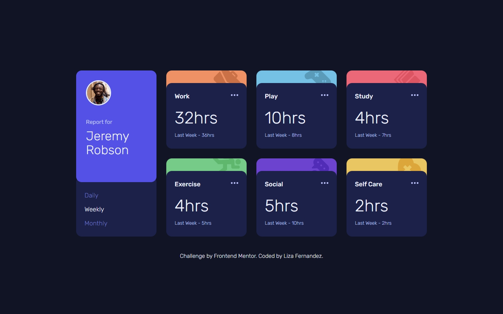
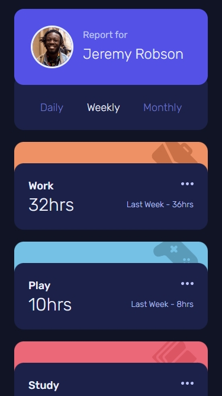

# Frontend Mentor - Time tracking dashboard solution

This is a solution to the [Time tracking dashboard challenge on Frontend Mentor](https://www.frontendmentor.io/challenges/time-tracking-dashboard-UIQ7167Jw). Frontend Mentor challenges help you improve your coding skills by building realistic projects.

## Table of contents

- [Overview](#overview)
  - [The challenge](#the-challenge)
  - [Screenshot](#screenshot)
  - [Links](#links)
- [My process](#my-process)
  - [Built with](#built-with)
  - [What I learned](#what-i-learned)
  - [Continued development](#continued-development)
  - [Useful resources](#useful-resources)
- [Author](#author)

## Overview

### The challenge

Users should be able to:

- View the optimal layout for the site depending on their device's screen size
- See hover states for all interactive elements on the page
- Switch between viewing Daily, Weekly, and Monthly stats

### Screenshot

**Desktop Layout**



**Mobile Layout**



### Links

- Solution URL: [time-tracking-dashboard-solution-lf.netlify.app](https://www.time-tracking-dashboard-solution-lf.netlify.app)
- Live Site URL: [Add live site URL here](https://your-live-site-url.com)

## My process

### Built with

- Semantic HTML5 markup
- CSS custom properties
- Flexbox
- CSS Grid
- Mobile-first workflow
- [Tailwind CSS](https://tailwindcss.com/) - CSS framework
- [Vite](https://vitejs.dev/) - Bundler
- [Prettier](https://prettier.io) - Code formatter

### What I learned

For this project, I challenged myself to use tailwind CSS and Vite. This project was the first time I used tailwind CSS and vite, so I was able to learn how to use them. The official documentation for tailwind css and vite helped me learn how to set up these tools.

Tailwind CSS is a utility-first framework. Thus, main.css contains only custom CSS variables. These variables are colours from the starter kit style guide.

I decided to install prettier and the official tailwind plugin. Having the classes sorted with these would make it easier to make changes and read the code in the future.

To populate data from the JSON file, the first step was to select the elements to populate data into. At first, I attempted to select these using array.filter() and elif statements. Using more than one array.filter() and elif statement, was not efficient. This method caused the website and data to load slow. I looked for a different method. The method I found was to use a map to map activity titles (i.e. work) to class names.

```js
/**
 * Maps activity titles from the data to the base class names used in the HTML.
 * @type {Map<string, string>}
 */
const titleToClassBaseMap = new Map([
  // [title, baseClassName] /*
  ["Work", "work"],
  ["Study", "study"],
  ["Exercise", "exercise"],
  ["Play", "play"],
  ["Social", "social"],
  ["Self Care", "self-care"],
]);
```

Another map was used to map the timeframe to elements with classes that will display data for previous periods.

```js
/** Maps the timeframe to the corresponding "previous" period's label. */
const previousTextMap = new Map([
  // [timeframeType, previousPeriodText]
  ["daily", "Yesterday"],
  ["weekly", "Last Week"],
  ["monthly", "Last Month"],
]);
```

Through the use of maps along with the fetch API, I was able to populate data into the dashboard. Compared to the first method, there was an improvement in the speed the data populated.

After deploying to a live site, data did not populate and I received a 404 message. The development tools console indicated it was the fetch API request. After some research, I found that the issue was the location of the JSON file. The file was in the root directory, which worked when testing on a live server. It did not work on the live site, as the site was bundled with vite. The file path I defined was the root of the project folder. For vite, this location had to be the public directory of the project folder.

### Continued development

For future projects, I would like to continue practicing using Javascript. In particular, I would like to practicing populating into HTML elements. I would also like to continue using tailwind CSS and vite.

### Useful resources

- [Tailwind CSS Documentation](https://tailwindcss.com/docs/installation/using-vite)
- [Vite Documentation](https://vite.dev/guide/)
- [W3 Schools JavaScript Maps](https://www.w3schools.com/js/js_maps.asp)

## Author

- Website - [Liza Fernandez](https://www.lizafernandez.dev)
- Frontend Mentor - [@aelvanna](https://www.frontendmentor.io/profile/aelvanna)
